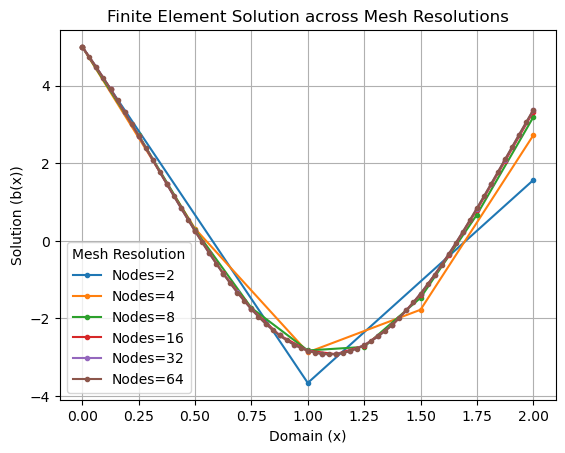
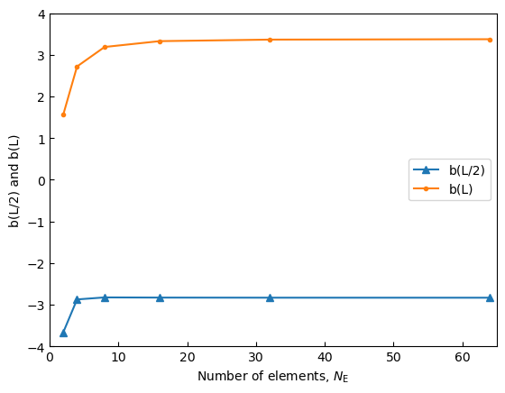

```python
# Required Libraries

import matplotlib.pyplot as plt                # Plotting library from Matplotlib
from fenics import *                           # All-inclusive import from FEniCS for solving differential equations

# Mesh & Function Space Definitions

domain_length = 2.0                            # Total length of the domain
mesh_resolutions = [2, 4, 8, 16, 32, 64]       # Different mesh resolutions to compute
solution_at_one = []                           # Storage for solution values at x=1
solution_at_two = []                           # Storage for solution values at x=2

# Boundary Conditions Function

def boundary_condition(x, on_bound):
    return on_bound and near(x[0], 0)

# Function to compute solution for given mesh size

def compute_solution(mesh_size):
    mesh = IntervalMesh(mesh_size, 0, domain_length) 
                                              # Creating mesh for interval
    V = FunctionSpace(mesh, 'P', 1)           # Function space definition (P1 elements)
    
# Defining boundary conditions

    left_bound_value = Constant(5)            # Constant value at left boundary
    right_bound_value = Constant(10)          # Constant value at right boundary
    boundary_cond = DirichletBC(V, left_bound_value, boundary_condition)  
                                              # Applying the boundary condition
    
# Setting up variational problem
    
    u = TrialFunction(V)                      # Defining the trial function (unknown)
    v = TestFunction(V)                       # Defining the test function
    source_term = Expression("-8 - 0.5*x[0]", degree=1)  
                                              # Defining the source function
    a = dot(grad(u), grad(v))*dx - 4*u*v*dx   # Bilinear form
    L = source_term*v*dx + right_bound_value*v*ds  
                                              # Linear form
    
# Solving the problem
    
    u_solution = Function(V)
    solve(a == L, u_solution, boundary_cond)
    
# Append results to lists

    solution_at_one.append(u_solution(1))
    solution_at_two.append(u_solution(2))
    return u_solution

# Executing solution computation and plotting

for resolution in mesh_resolutions:
    solution = compute_solution(resolution)
    plot(solution, marker='.', label=f"Nodes={resolution}")

# Configuring and displaying plot

plt.xlabel("Domain (x)")
plt.ylabel("Solution (b(x))")
plt.title("Finite Element Solution across Mesh Resolutions")
plt.legend(title="Mesh Resolution")
plt.grid(True)
plt.show()

# Plotting the relationship between the result and the number of grids

plt.tick_params(direction="in")              # Setting up the plot style
plt.plot(mesh_resolutions, solution_at_one, marker="^", label="b(L/2)")
                                             # Plotting results at x=1
plt.plot(mesh_resolutions, solution_at_two, marker=".", label="b(L)")
                                             # Plotting results at x=2
plt.xlabel("Number of elements, $N_{\mathrm{E}}$")
                                             # Setting the labels and limits for the plot
plt.ylabel("b(L/2) and b(L)")
plt.xlim((0, 65))                            # Assuming the maximum element size you'd go is 64 as per your array
plt.ylim((-4, 4))                            # Adjusted according to the potential range of your function

# Adding a legend and showing the plot

plt.legend(loc=5)                            # loc=5 corresponds to 'right' position of the legend
plt.show()

#END.
#EDITTED BY ZHAOYIHANG 
```

    Solving linear variational problem.
    Solving linear variational problem.
    Solving linear variational problem.
    Solving linear variational problem.
    Solving linear variational problem.
    Solving linear variational problem.


    

    


    

    


```python

```
