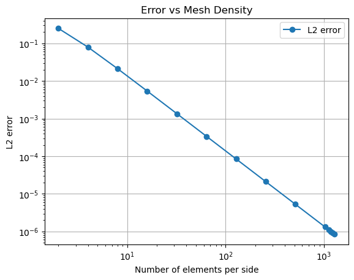

```python
# Import all the libararies.

from fenics import *
import matplotlib.pyplot as plt
import numpy as np

# List of number of elements per side for the mesh.

element_counts = [2, 4, 8, 16, 32, 64, 128, 256, 512, 1024, 1126, 1177, 1230, 1280]
l2_errors = []

# Looping over different mesh sizes.

for count in element_counts:
    mesh = UnitSquareMesh(count, count)             # Create a unit square mesh.
    function_space = FunctionSpace(mesh, 'P', 1)    # Define function space.
    u_D = Expression('sin(pi*x[0])*sin(pi*x[1])', degree=4)
                                                    # Define boundary condition with a higher degree for accuracy.
    def boundary_condition(x, on_boundary):         # Boundary condition function.
        return on_boundary
    bc = DirichletBC(function_space, u_D, boundary_condition)
                                                    # Apply Dirichlet boundary condition.
        
 # Define variational problem.   

    u = TrialFunction(function_space)              
    v = TestFunction(function_space)                

# Define source term with a higher degree for accuracy.

    f = Expression('2*pi*pi*sin(pi*x[0])*sin(pi*x[1])', degree=4)
    a = dot(grad(u), grad(v)) * dx
    L = f * v * dx

# Compute solution.

    u_solution = Function(function_space)
    solve(a == L, u_solution, bc)

# Calculate L2 error and append to the list.

    error_L2 = errornorm(u_D, u_solution, 'L2')
    l2_errors.append(error_L2)

# Plotting the results.

plt.plot(element_counts, l2_errors, 'o-', label='L2 error')
plt.xlabel('Number of elements per side')
plt.ylabel('L2 error')
plt.yscale('log')
plt.xscale('log')
plt.title('Error vs Mesh Density')
plt.legend()
plt.grid(True)
plt.show()

# Print the L2 errors.

print(l2_errors)

#END.
#EDITTED BY ZHAOYIHANG
```

    Solving linear variational problem.
    Solving linear variational problem.
    Solving linear variational problem.
    Solving linear variational problem.
    Solving linear variational problem.
    Solving linear variational problem.
    Solving linear variational problem.
    Solving linear variational problem.
    Solving linear variational problem.
    Solving linear variational problem.
    Solving linear variational problem.
    Solving linear variational problem.
    Solving linear variational problem.
    Solving linear variational problem.


    

    


    [0.24966856360600717, 0.07907484236848367, 0.021132756064082887, 0.005377434702809404, 0.0013504362436109472, 0.00033799233477620596, 8.452209814415982e-05, 2.1132026741535635e-05, 5.283101725014492e-06, 1.3207859556603694e-06, 1.0923272561160896e-06, 9.997136686621157e-07, 9.154243615613052e-07, 8.453030724233949e-07]


```python

```
