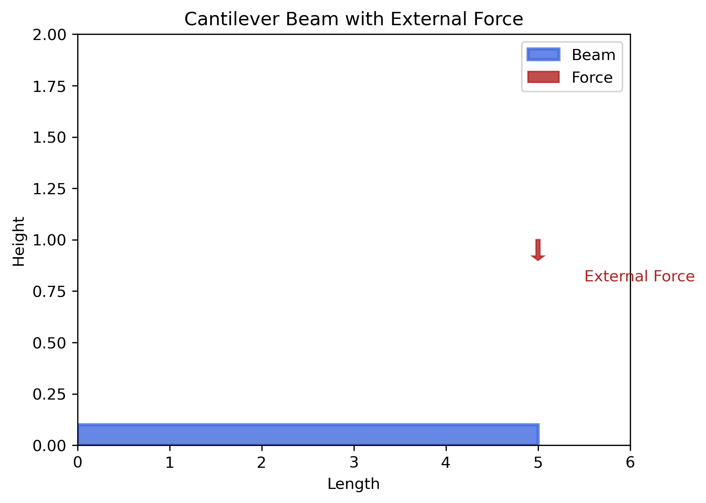
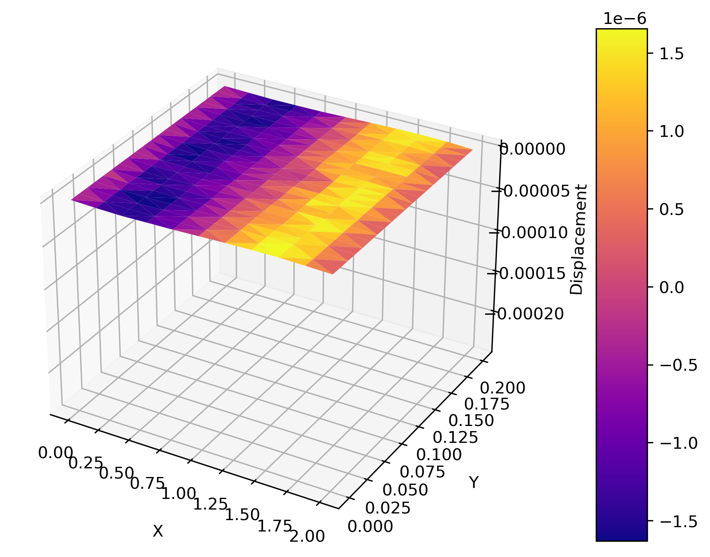

## 弯曲悬臂梁问题

考虑一个悬臂梁，其中一端被固定，另一端施加一个垂直向下的集中力。我们的目标是求解梁的弯曲位移场。

### 问题描述

1. **几何形状和边界条件**：
   - 梁的几何形状：$$长度 (L)，高度 (H)，宽度 (W)$$
   - 固定边界条件：一端固定。
   - 外部力：梁自由端施加垂直向下的力。

2. **物理模型**：
   - 弹性体平衡方程：$$(\nabla \cdot \sigma + \mathbf{f} = \mathbf{0})，其中 (\sigma) 是应力张量，(\mathbf{f}) 是外部力密度。$$
   - 胡克定律（线性弹性材料）：$$(\sigma = 2\mu\epsilon(\mathbf{u}) + \lambda , \text{tr}(\epsilon(\mathbf{u}))\mathbf{I})，其中 (\mu) 是剪切模量，(\lambda) 是拉伸模量，(\epsilon(\mathbf{u})) 是位移场的对称梯度（应变张量），(\mathbf{I}) 是单位张量。$$

### 解决方法

1. **建立几何和网格**：
   - 使用 FEniCS 创建悬臂梁的几何形状，并生成适当的网格。

2. **定义函数空间**：
   - 使用 FEniCS 定义位移场的函数空间。

3. **设置边界条件**：
   - 定义悬臂梁的固定边界条件和施加的力。

4. **定义变分问题**：
   - 使用平衡方程和材料本构方程构建变分问题。

5. **求解变分问题**：
   - 使用 FEniCS 的 `solve` 函数求解变分问题。

6. **绘制结果**：
   - 使用 Matplotlib 绘制悬臂梁的弯曲位移场。
   - 调整图形属性，如颜色、分辨率和坐标轴标签位置，以得到更美观的图像。

### 通过以上步骤，我们可以建立一个数值模型，求解悬臂梁的弯曲问题，并可视化位移场。


```python
#Figure of the problem(not the result)!!!!

import matplotlib.pyplot as plt
import numpy as np

# Define the geometric parameters of the cantilever

length = 5.0
height = 1.0
force_location = (length, height)

# Create plot and set DPI to 300

fig, ax = plt.subplots(dpi=300)

# Draw the cantilever geometry using bright blue and add shading and transparency

beam_shape = plt.Rectangle((0, 0), length, height/10, color='royalblue', edgecolor='black', linewidth=2, alpha=0.8, label='Beam')
ax.add_patch(beam_shape)

# Draw the external force, use bright red, and add shading and transparency

force_arrow = plt.Arrow(force_location[0], force_location[1], 0, -0.1, color='firebrick', width=0.2, alpha=0.8, label='Force')
ax.add_patch(force_arrow)

# Set the axis label and title

ax.set_xlabel('Length')
ax.set_ylabel('Height')
ax.set_title('Cantilever Beam with External Force')

# Set the axis label and title

ax.text(force_location[0] + 0.5, force_location[1] - 0.2, 'External Force', color='firebrick')

# Set the axis scale

ax.set_xlim(0, length + 1)
ax.set_ylim(0, height + 1)

# Display legend

ax.legend()
plt.show()

```

    /tmp/ipykernel_2969/1712138083.py:18: UserWarning: Setting the 'color' property will override the edgecolor or facecolor properties.
      beam_shape = plt.Rectangle((0, 0), length, height/10, color='royalblue', edgecolor='black', linewidth=2, alpha=0.8, label='Beam')


    

    


```python
#Figure of the result!!!!

from fenics import *
import matplotlib.pyplot as plt
from mpl_toolkits.mplot3d import Axes3D
from matplotlib import cm

# Define the geometric and material properties of the cantilever beam

length = 2.0                                  # Length of the beam
height = 0.2                                  # Height of the beam
width = 0.01                                  # Width of the beam
force = 100.0                                 # Force applied at the free end of the beam

# Create mesh

mesh = BoxMesh(Point(0, 0, 0), Point(length, height, width), 10, 20, 10)

# Define function space

V = VectorFunctionSpace(mesh, 'P', 1)

# Define boundary conditions

def boundary(x, on_boundary):
    return near(x[0], 0)                      # Boundary condition: Fixed boundary on the x-axis
bc = [DirichletBC(V, Constant((0, 0, 0)), 'near(x[0], 0)'),
      DirichletBC(V, Constant((0, 0, 0)), 'near(x[0], {})'.format(length))]

# Define displacement field and test function

u = TrialFunction(V)
v = TestFunction(V)

# Define material parameters

E = 1e9                                       # Young's modulus
nu = 0.3                                      # Poisson's ratio
mu = E / (2 * (1 + nu))                       # Shear modulus
lambda_ = E * nu / ((1 + nu) * (1 - 2 * nu))  # Elastic constant

# Elastic tensors
def epsilon(u):
    return sym(nabla_grad(u))

def sigma(u):
    return 2 * mu * epsilon(u) + lambda_ * tr(epsilon(u)) * Identity(len(u))

# Variational form for the bending problem

a = inner(sigma(u), sym(grad(v))) * dx
L = dot(Constant((0, 0, -force)), v) * ds

# Solve the variational problem

u = Function(V)
solve(a == L, u, bc)

# Get coordinates of the mesh and values of the solution

coordinates = mesh.coordinates()
u_values = u.compute_vertex_values(mesh)

# Plot the displacement field in 3D using the 'plasma' colormap

fig = plt.figure(dpi=300)
ax = fig.add_subplot(111, projection='3d')
trisurf = ax.plot_trisurf(coordinates[:, 0], coordinates[:, 1], u_values, cmap=cm.plasma)

# Add a colorbar

fig.colorbar(trisurf, ax=ax, pad=0.1, aspect=10)
ax.set_xlabel('X', labelpad=10)
ax.set_ylabel('Y', labelpad=10)
ax.set_zlabel('Displacement', labelpad=10)

# Adjust the layout of the figure

plt.tight_layout()
plt.show()


#END
#EDITTED BY ZHAOYIHANG
```

    Solving linear variational problem.


    

    


```python

```
